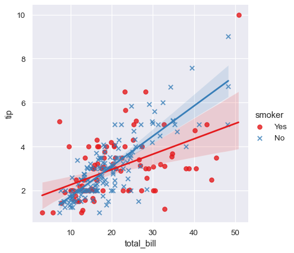
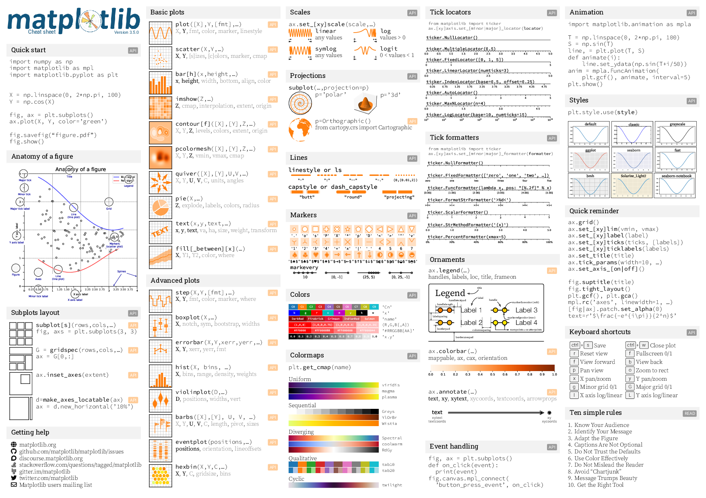
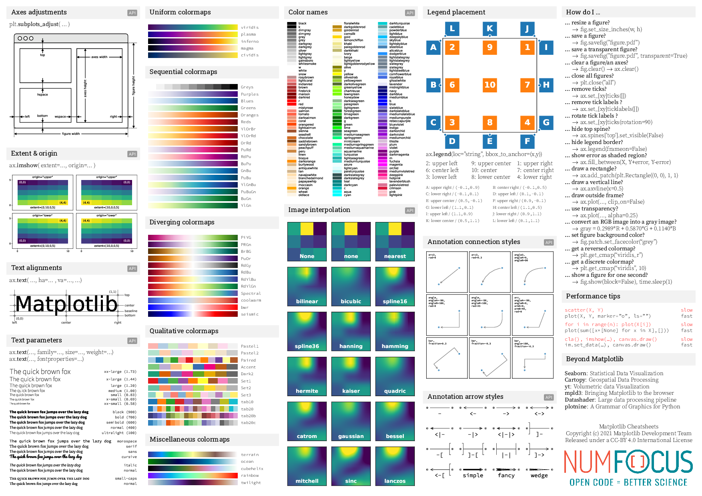
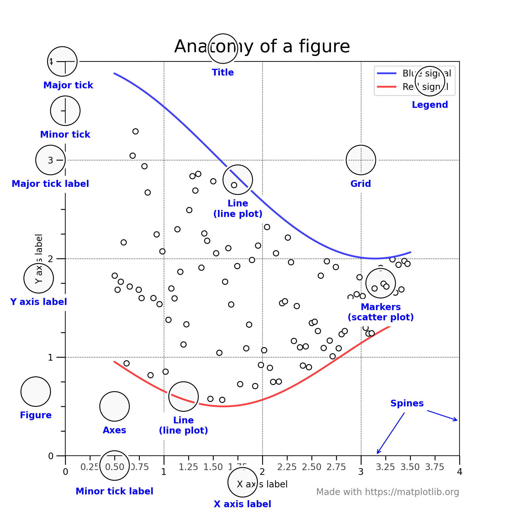

# Publishing with Python        ---->   
An introduction to using data visualization libraries for creating your figures

There are many different libraries one can use for data visualization in python. They all have different strengths and weaknesses. In this workshop, we'll examine creating visuals by relying on two libraries: *maplotlib* and *seaborn*, but be aware there are others that may fit your purposes better.

In addition to the plotting libraries we'll examine, we'll also introduce *numpy* and *pandas*, two packages essential for organizing data to be easily examined and displayed.

## Workshop Goals

By the end of this workshop, you'll:

- Be familiar with the python visualization libraries *matplotlib* and *seaborn* and how they work
- Have exposure to the libraries *numpy*, *pandas* and *geopandas* for working with data
- Know how to use python for creating figures to add to reports, posters and papers

## Workshop Resources

- [Matplotlib Tutorials](https://matplotlib.org/stable/tutorials/)
- [Seaborn User Guide](https://seaborn.pydata.org/tutorial.html)
- [NumPy Documentation](https://numpy.org/doc/stable/)
- [Pandas Documentation](https://pandas.pydata.org/docs/)
- [GeoPandas Documentation](https://geopandas.org/en/stable/docs.html)
- You can find datasets we'll use in this [data folder](https://www.dropbox.com/sh/wk6t92vp4l4cq53/AAAFzaD07V2LyKdhAjO54tefa?dl=0) on Dropbox
- Other similar Airbnb data can be found on the [Inside Airbnb website](http://insideairbnb.com/get-the-data/)
- [Jupyter Notebook](https://mybinder.org/v2/gh/frizatch/Python-Publishing-Data-Visualizations.git/main?labpath=PublishingWithPython.ipynb) of examples accessed via Binder

## Data Visualization Libraries
Here is a brief table highlighting a few and why you may want to use them:

| Library | Description | Pros | Cons | Interactivity |
| ------- | ----------- | ---- | ---- | ------------- |
| [Matplotlib](https://matplotlib.org/) | low-level work horse library | versatile | refining graphic is complex | no |
| [Seaborn](https://seaborn.pydata.org/) | high-level library based on matplotlib | minimal code for high-level graphics | not as many chart options as matplotlib | no |
| [Bokeh](https://bokeh.org/) | interactive version of matplotlib |  high-performance interactive charts and plots| refining graphic more complex than higher-level libraries | yes |
| [Plotly](https://plotly.com/python/) | high-level graphing library | high-performance interactive charts and plots, including 3D | confusing platform with many tools | yes |
| [Folium](https://python-visualization.github.io/folium/) | specifically for creating map visualizations | visualize choropleth or markers on Leaflet maps| narrow purpose library | yes |
| [Geoplotlib](https://github.com/andrea-cuttone/geoplotlib/wiki/User-Guide) | Library specifically for geospatial visualization | navigable map as output | need to screenshot output, seems no longer maintained | yes |

Note: *Both Pandas and Geopandas have Dataframe.plot methods that are convenient wrappers around Matplotlib to create simple plots*

Here are the ones we'll focus on:

## [Matplotlib](https://matplotlib.org/)

You can see the [common plot types](https://matplotlib.org/stable/plot_types/index.html) available for matplotlib. The [gallery page](https://matplotlib.org/stable/gallery/index.html) for matplotlib has many examples of full figures with available source codes for their creation.

Matplotlib also supplies these amazing [cheetsheets](https://matplotlib.org/cheatsheets/) and other handouts on their website. I'm mainly including them here to give a visual sense of all that can be accomplished with this library:

### Figure Anatomy - building on the basics

Many data visualization python libraries build on top of matplot lib, so understanding the basic building blocks here is useful.

Some definitions:

- *Figure* - The whole figure. It contains the axes, axis and other artists.
- *Axes* - An Axes is an Artist attached to a Figure that contains a region for plotting data
- *Axis* - These objects set the scale and limits and generate ticks (the marks on the Axis) and ticklabels
- *Artist* - Basically, everything visible on the Figure is an Artist (even Figure, Axes, and Axis objects)

All of these objects can be styled by passing arguments to called methods.

There is detailed information and examples on styling figures on matplotlib's [Introductory Usage Guide](https://matplotlib.org/stable/tutorials/introductory/usage.html), but we'll go over some of these in our notebook. The best way to learn is to play!

## NumPy

"The fundamental package for scientific computing with Python"

This package is for effeciently working with data in arrays. Data visualization libraries like having data in arrays.

## Pandas and GeoPandas

[Pandas](https://pandas.pydata.org/) is a fast, powerful, flexible and easy to use open source data analysis and manipulation tool.

[GeoPandas](https://geopandas.org/en/stable/) is similar, but with the added capability of geospatial rendering.

## [Seaborn](https://seaborn.pydata.org/)

Seaborn is a Python data visualization library based on matplotlib. It provides a high-level interface for drawing attractive and informative statistical graphics.

Basically, it mushes all the capabilities of the methods in matplotlib into higher level ones and does things automatically for you so you have to write less code.

## Notebook Exercises

You can launch the notebook in two different ways:
- Directly from the top of this README.md under "Workshop Resources" using Binder
- Go to the main repository page, retrieve the .ipynb file, and launch Jupyter Notebooks from your own python environment.

